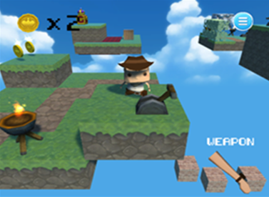
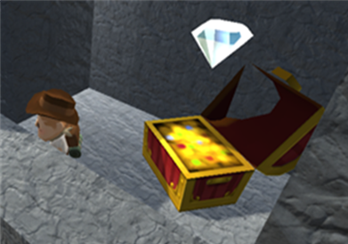
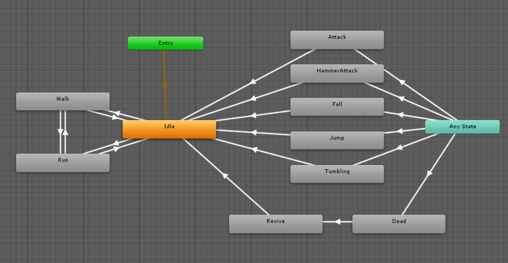
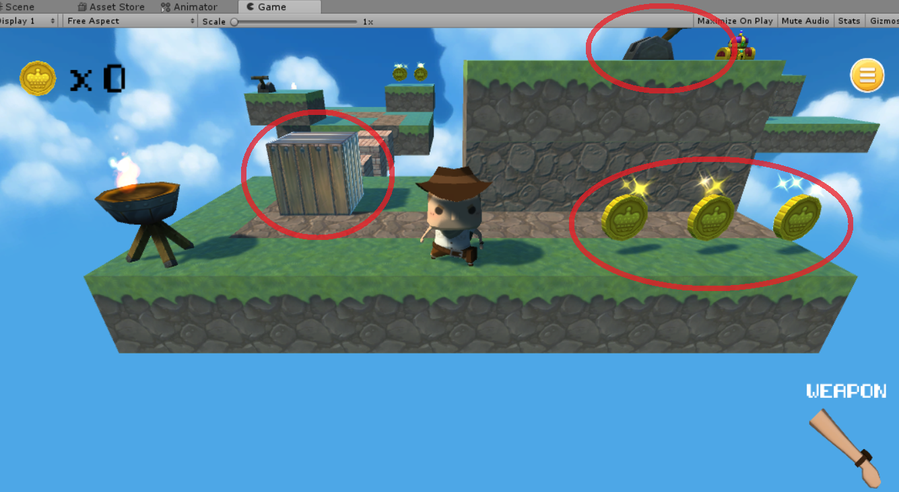

## 프로젝트 개요
- 전 연령층이 쉽게 이용할 수 있는 캐쥬얼 게임 제작을 목표로 했다.
- Low Polygon(적은 수의 다각형을 갖는 폴리곤 메쉬)과 블록 모양의 아기자기한 맵디자인을 적용했다.
- Unity3D 환경에서 C#을 스크립트 언어로 사용했다.

## 게임의 진행

 

- 게임은 플레이어가 여러 섬을 돌아다니며 보물을 수집하는 방식으로 진행한다.

- 각 스테이지는 '숲', '화산'과 같은 테마를 갖는다.

 - 플레이어가 스테이지의 보물을 획득하면 다음 스테이지로 넘어간다.  

 - 플레이어는 기본적으로 점프, 달리기 등의 동작만이 가능하지만, 스테이지의 도구를 이용하면 새로운 동작(상자밀기, 바위 부수기 등)을 수행할 수 있다.

 - 클리어 시간에 따라 점수를 다르게 부여한다.

 ## 프로젝트 주요 기술
- 플레이어와 아이템(보물상자, 스위치 등)은 모두 FSM(Finite State machine)에 따라 동작하도록 구현했다.

예시) 플레이어의 FSM

위 그림은 플레이어의 FSM으로, 회색 박스는 각각의 상태를 나타내며 고유의 에니메이션을 갖는다.

플레이어는 키보드 입력, 타 객체와의 상호작용(주로 충돌)에 따라 상태가 변화하게 된다.

## 프로젝트의 특징 - 손쉬운 확장

캐릭터와 상호작용하는 아이템들에는 Prefap이 적용되어 추가와 삭제가 용이하다.

그 크기 또한 맵의 블록 1개와 같은 크기를 가지므로, 퍼즐 게임을 만들듯이 새 스테이지를 추가할 수 있다.

## 프로젝트 실행 영상
https://www.youtube.com/watch?v=HfwYFMoveF0
